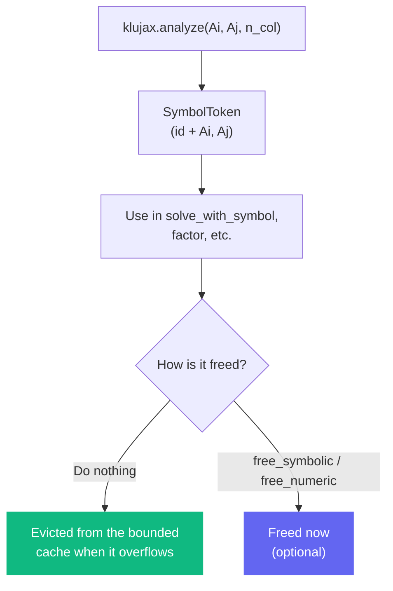

# Memory Management

When you use the split API (`analyze`, `factor`, `refactor`), klujax builds KLU
objects that live in C++ memory. A handle to one of those objects is a **token**,
not a raw pointer: a small integer id into a process-wide cache, bundled with the
arrays needed to rebuild the object it names. This makes handles memory-safe.

## The Basics



## Why handles are safe

A handle is a key into a bounded cache, so the two classic hazards go away:

- **Forgetting to free leaks only a bounded amount.** The cache holds a fixed
  number of KLU objects (eight by default). When it overflows, the least
  recently used one is evicted. Handles you never free cost at most a full
  cache, not unbounded memory. Set the size with the `KLUJAX_FACTOR_CACHE`
  environment variable.
- **Using a freed or evicted handle is safe.** Every call carries the arrays the
  handle needs (a symbolic token carries `Ai`, `Aj`, and a numeric token also
  carries `Ax`). A call that lands on a handle no longer in the cache rebuilds
  the object on the spot from those arrays and continues. The answer is the
  same, it just costs the rebuild.

That is why freeing is optional and there is no "ghost pointer" to guard
against: a stale token cannot dereference freed memory, because there is no
pointer to dereference.

## Outside JIT

Cleanup needs no thought. Free eagerly if you want the memory back sooner, or do
nothing and let the cache bound it.

```python
symbolic = klujax.analyze(Ai, Aj, n_col)
x = klujax.solve_with_symbol(Ai, Aj, Ax, b, symbolic)

# Optional: free now. Reusing `symbolic` afterwards still works, it rebuilds.
symbolic.close()            # or klujax.free_symbolic(symbolic)
```

A token is also a context manager, which frees the cache slot on exit:

```python
with klujax.analyze(Ai, Aj, n_col) as symbolic:
    x = klujax.solve_with_symbol(Ai, Aj, Ax, b, symbolic)
```

## Inside JIT

The same calls work inside `jax.jit`. A token's id is an ordinary array, so it
threads through the trace as data and XLA orders `analyze -> factor -> solve` by
that data dependency. A bare free is the exception: it does not consume the
solve's output, so XLA may run it first. That is safe, since a solve that lands
on a freed entry rebuilds it, but the rebuild wastes the work the free was meant
to save. See the next section to order the free.

```python
@jax.jit
def solve_inside_jit(Ai, Aj, Ax, b):
    sym = klujax.analyze(Ai, Aj, 5)
    x = klujax.solve_with_symbol(Ai, Aj, Ax, b, sym)
    klujax.free_symbolic(sym.track(x))   # ordered after the solve
    return x
```

## When is it safe to free explicitly?

Two different questions hide here, and they have different answers.

**Correctness: always safe.** A token whose cache entry was freed rebuilds
itself on next use, so an early, late, or reordered free can never crash or
return a wrong answer. You may call `free_symbolic` / `free_numeric` (or
`close()`) at any point.

**Effectiveness: only when the free runs after the token's last use.** A free
reclaims memory without forcing a wasted rebuild only if nothing uses the token
afterward. Freeing eagerly in Python, after the step that used the token has
run, gives you that ordering for free:

```python
x = fast_solve(Ax_t, b_t)   # jitted, uses `numeric`
# ... done with this factorization ...
numeric.close()             # runs after the solve, so it actually frees
```

Inside a single `jax.jit` trace a bare free and a solve on the same token are
unordered, because the free does not consume the solve's output. To order the
free after a solve, give it that solution to depend on, either by passing it as
`dependency` or by calling `token.track(solution)` first:

```python
@jax.jit
def step(Ax, b):
    num = klujax.factor(Ai, Aj, Ax, sym)
    x = klujax.solve_with_numeric(num, b, sym)
    klujax.free_numeric(num, dependency=x)   # ordered after the solve
    return x
```

`track` folds the solve into the token instead, which is handy in a loop: track
each step's solution, then free the token once after the loop.

## Best Practice: Create Outside, Use Inside

The simplest and fastest pattern is still to analyze once and reuse:

```python
symbolic = klujax.analyze(Ai, Aj, n_col)

@jax.jit
def fast_solve(Ax, b):
    return klujax.solve_with_symbol(Ai, Aj, Ax, b, symbolic)

for t in range(1000):
    x = fast_solve(Ax_t, b_t)
```

## Tuning the cache

Rebuilds are correct but not free, so a program that keeps more factorizations
live than the cache holds pays to rebuild them again and again. Two tools find
that:

- `klujax.rebuild_count()` returns how many rebuilds have happened (reset it with
  `klujax.reset_rebuild_count()`). A count that climbs during steady-state
  solving means the working set is larger than the cache.
- Setting `KLUJAX_STRICT_CACHE` turns any rebuild into an error naming the
  token, so a lost factorization fails loudly instead of quietly slowing
  things down. Leave it off in production and switch it on while debugging
  performance.

| Setting                | Effect                                              |
| ---------------------- | --------------------------------------------------- |
| `KLUJAX_FACTOR_CACHE`  | Max live KLU objects before LRU eviction (default 8) |
| `KLUJAX_STRICT_CACHE`  | If set, a rebuild raises instead of happening quietly |

## Token Details

A token is a JAX pytree, so it flows through `jit`, `vmap`, and `grad`.

| Property | Description                                              |
| -------- | -------------------------------------------------------- |
| `id`     | uint64 cache key (one per left-hand side for a numeric)  |
| `handle` | Alias of `id`                                            |
| `Ai`, `Aj` | The sparsity pattern, carried so the object can rebuild |
| `Ax`     | The values (numeric tokens only), carried to rebuild     |
| `n_col`  | The matrix dimension (static)                            |
| `n_dependent_solutions` | Count of solutions passed to `track`, which a free consumes to order itself after them |

`token.track(solution)` returns a token with the solution folded into
`n_dependent_solutions`, so a later `free` on it is ordered after that solve.

## Rules of Thumb

1. **Analyze once, reuse** for the best performance.
2. **Freeing is optional.** Use `close()` or `free_*` only to release memory
   sooner. The token stays usable afterwards.
3. **Watch `rebuild_count()`** if performance matters. A rising count means
   raise `KLUJAX_FACTOR_CACHE`.
4. **Numeric handles from batched factor** hold one id per left-hand side.
   `free_numeric` frees all of them.

## Full Lifecycle Example

```python
import klujax

# === Setup ===
symbolic = klujax.analyze(Ai, Aj, n_col)
numeric = klujax.factor(Ai, Aj, Ax, symbolic)

# === Use ===
for step in range(num_steps):
    if matrix_changed:
        numeric = klujax.refactor(Ai, Aj, Ax_new, numeric, symbolic)
    x = klujax.solve_with_numeric(numeric, b, symbolic)

# === Cleanup (optional) ===
numeric.close()
symbolic.close()
```
